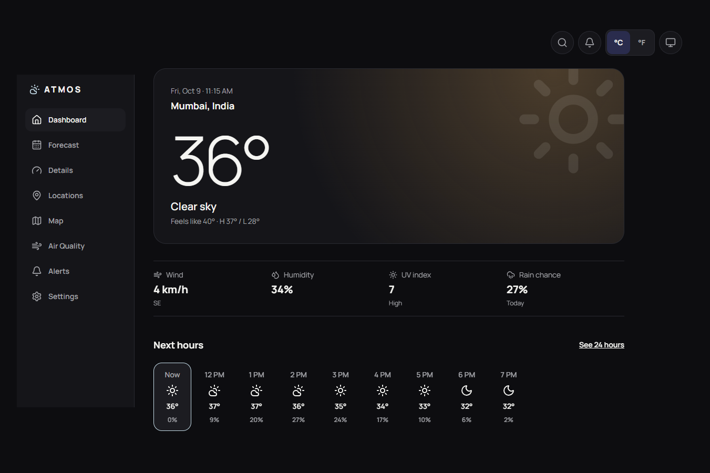
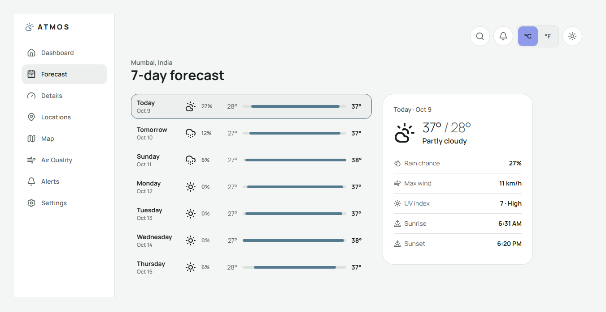
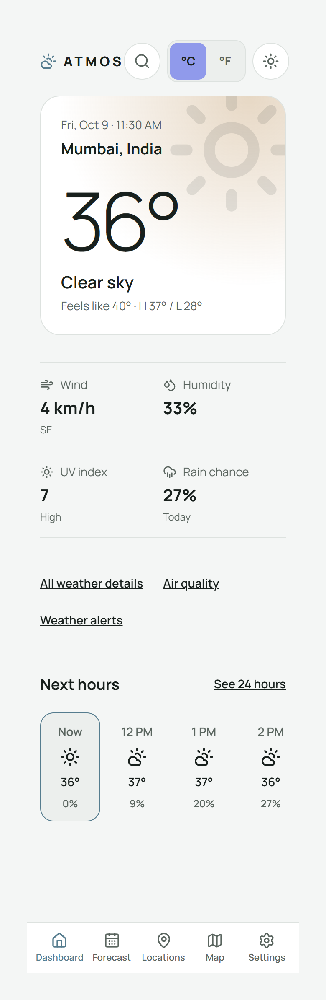
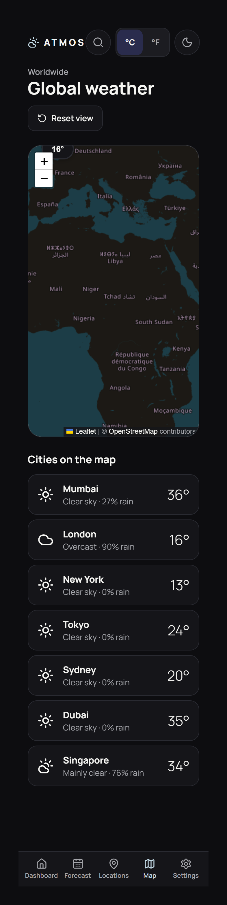

# ATMOS

A fast, responsive weather app built with React, Tailwind CSS and Open-Meteo.
Live conditions, hourly and 7-day forecasts, air quality, saved cities and a
world weather map, with light and dark themes.

**Live demo:** https://atmos-weather-in.vercel.app/



| Forecast (light) | Mobile | World map |
|---|---|---|
|  |  |  |

## Features
- Live current weather, with feels-like, wind, humidity, UV and rain chance
- Hourly forecast with a temperature curve and rain-chance chart
- 7-day forecast with temperature range bars and per-day details
- Weather details: wind compass, UV scale, sun arc and pressure trend
- Air quality with an AQI scale and the main pollutants
- City search (debounced), saved locations and a default city
- Use current location, with a clear permission-denied state
- World weather map with temperature markers and a popup
- Generated weather alerts with clear severity labels
- Settings: theme, units, notification preferences and accessibility options
- Light, dark and system themes; °C/°F, km/h/mph and hPa/inHg units
- Loading skeletons, error with retry, and offline states

## Tech stack
- React + Vite
- Tailwind CSS v4
- React Router
- TanStack Query (data fetching and caching)
- Recharts (charts) and Leaflet (map), both lazy-loaded
- Open-Meteo APIs: forecast, geocoding and air quality (free, no API key)
- Lucide icons and Manrope (self-hosted with Fontsource)

## Accessibility and performance
- Keyboard friendly, with a skip link and visible focus outlines
- Meaning is never carried by colour alone (labels, icons and text)
- Respects `prefers-reduced-motion`, plus an in-app Reduce motion option
- Charts and the map have text alternatives
- Lighthouse (mobile): see the table below

| Performance | Accessibility | Best Practices | SEO |
|---|---|---|---|
| 98 | 100 | 100 | 91 |


## Run it locally
```bash
git clone https://github.com/karanpr01/ATMOS-weather.git
cd atmos-weather
npm install
npm run dev
```

Build for production with `npm run build` and preview it with `npm run preview`.

## Project structure
```
src/
  components/   reusable UI (hero, stats, skeletons, toggles…)
  context/      shared settings (theme, units, saved cities)
  hooks/        useWeather, useAirQuality, useDebounce, useLocalStorage…
  lib/          API calls, unit helpers, alert rules, AQI scale
  pages/        one file per screen
```

## Known limitations
- Alerts are generated from forecast rules for this project. They are **not**
  official warnings.
- Notification switches save your choice, but notifications are not sent yet.
- "Current location" shows coordinates, because the free API has no reverse lookup.

## Credits
- Weather data by [Open-Meteo.com](https://open-meteo.com/)
- Map data © [OpenStreetMap](https://www.openstreetmap.org/copyright) contributors

